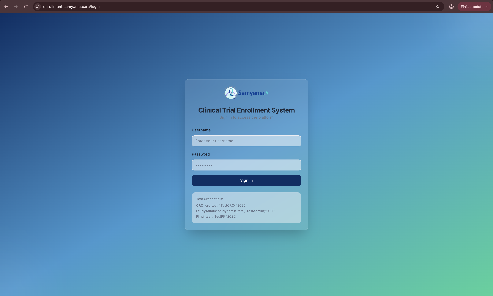
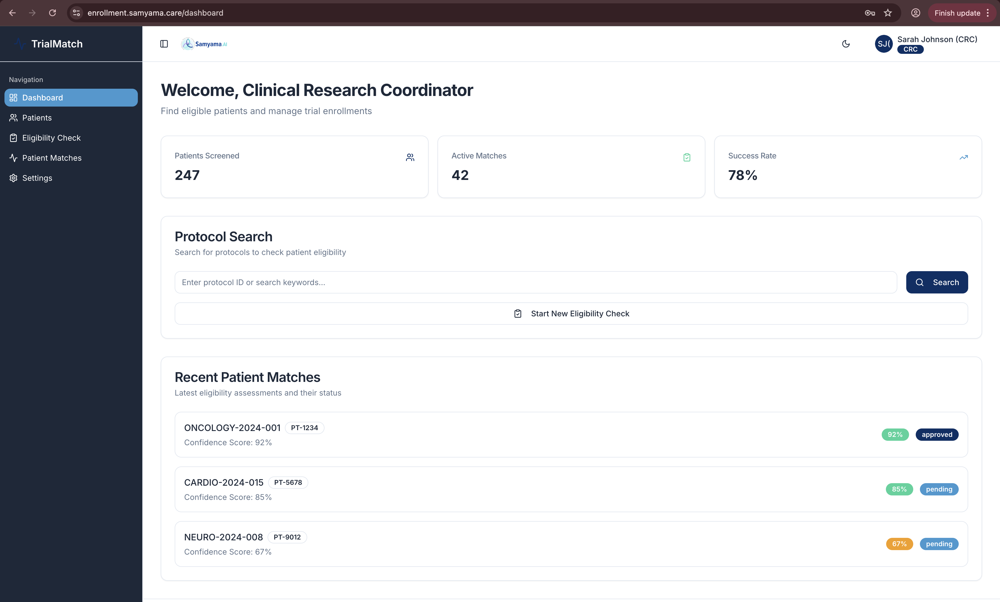
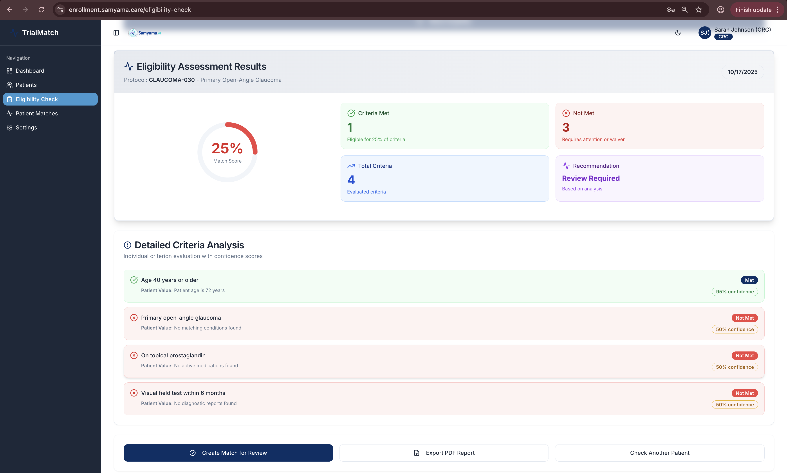
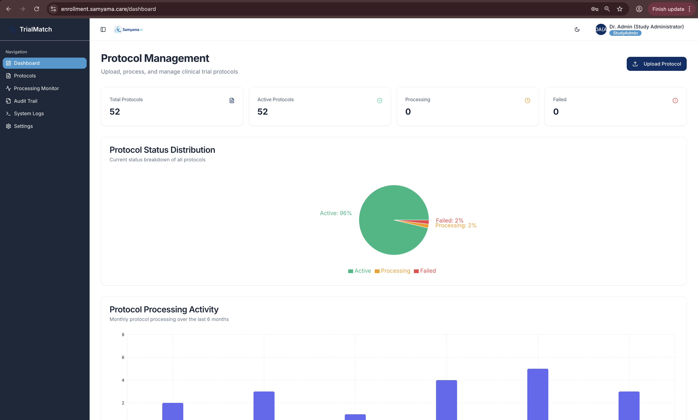
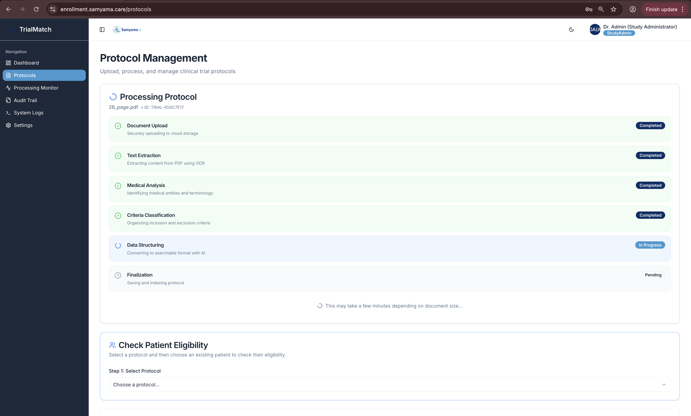
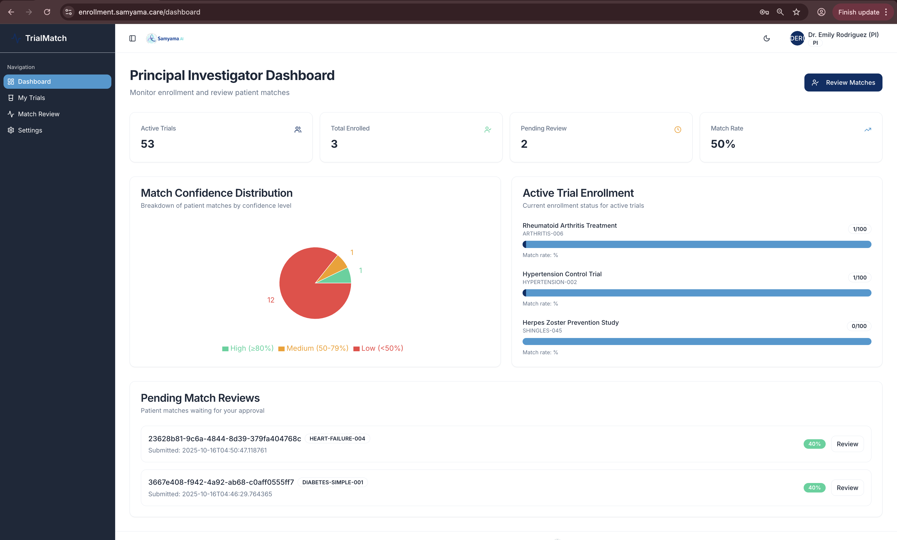
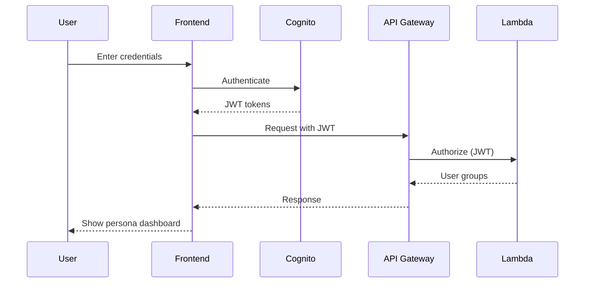
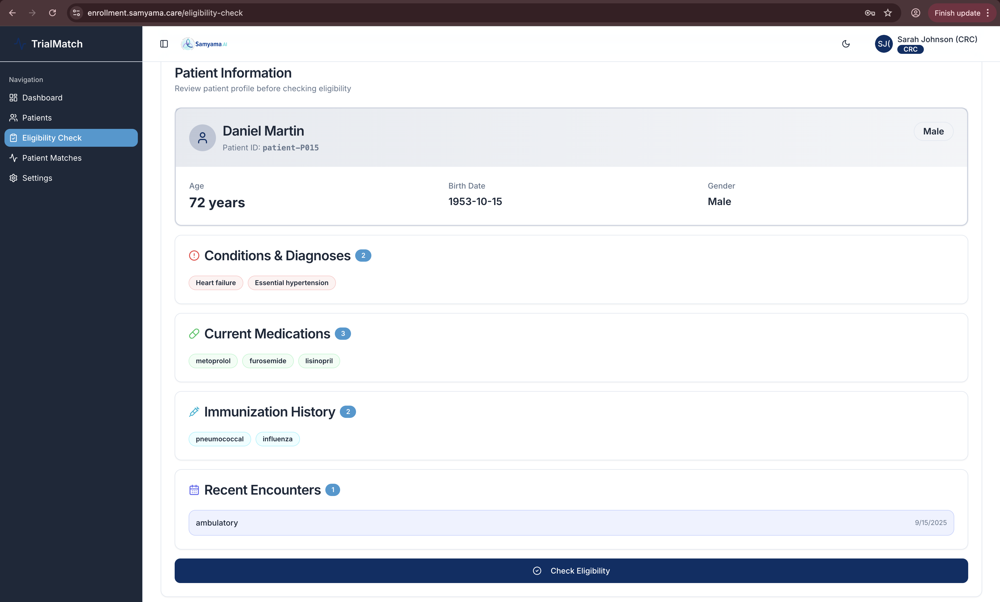
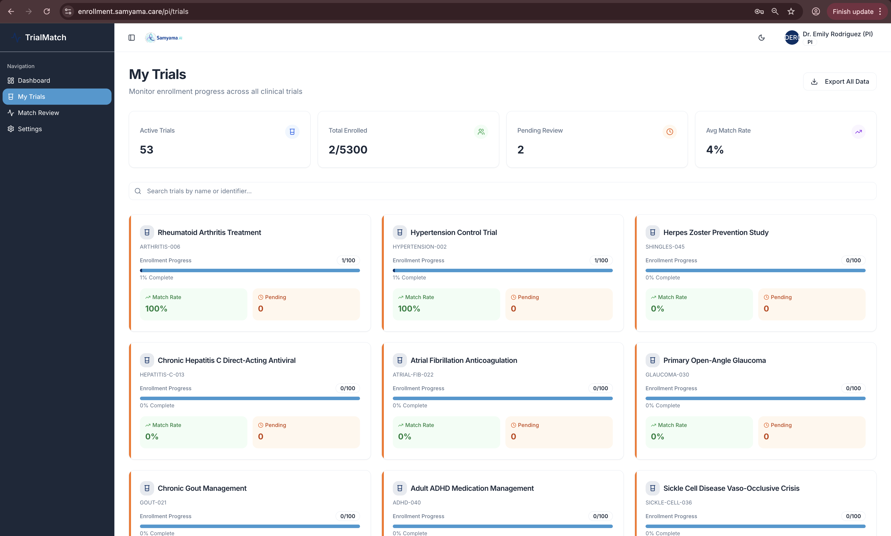

# Trial Compass Pro - Frontend

<div align="center">


**Modern React Frontend for AWS Trial Enrollment System**

[Live Demo](https://enrollment.samyama.care) • [Backend Repo](https://github.com/VaidhyaMegha/samyama-trial-enrollment-agent) • [AWS Hackathon](https://aws-agent-hackathon.devpost.com/)

</div>

---

## 🎯 Overview

**Trial Compass Pro** is the modern React frontend for the AWS Trial Enrollment System, providing intuitive interfaces for three distinct user personas: Clinical Research Coordinators (CRC), Study Administrators, and Principal Investigators (PI). Built with React 18, TypeScript, and Tailwind CSS, it delivers a fast, responsive, and accessible user experience.

This frontend connects to an AI-powered backend running on AWS with Amazon Bedrock (Mistral Large 2), AWS HealthLake, Textract, and Comprehend Medical to automate clinical trial patient matching.

---

## ✨ Key Features

### 🎨 Modern UI/UX



- **Samyama.ai Branding**: Professional healthcare design with custom theming
- **Dark/Light Mode**: Automatic theme switching with system preferences
- **Responsive Design**: Mobile-first approach for tablet and desktop
- **Accessibility**: WCAG 2.1 AA compliant with keyboard navigation
- **Smooth Animations**: Framer Motion for polished interactions

### 👥 Three User Personas

#### 1. Clinical Research Coordinator (CRC)



**Patient Screening Workflow**
- Search and select patients from AWS HealthLake
- Run AI-powered eligibility checks
- View confidence scores and criterion-by-criterion results
- Track screening metrics (247 patients screened, 78% success rate)
- Export PDF reports with Samyama branding



**Eligibility Check Results**
- Match score visualization (circular gauge)
- Detailed criteria analysis with confidence scores
- Medical entity extraction from FHIR resources
- Explainable AI reasoning from Mistral Large 2

#### 2. Study Administrator (StudyAdmin)



**Protocol Management**
- Upload protocol PDFs with drag-and-drop
- Monitor AI agent processing pipeline
- View protocol status distribution charts
- Track processing activity over time
- Manage 52+ protocols with 96% active status



**6-Phase AI Pipeline Visualization**
1. Document Upload (S3)
2. Text Extraction (AWS Textract)
3. Medical Analysis (Comprehend Medical)
4. Criteria Classification
5. Data Structuring (Mistral Large 2)
6. Finalization (DynamoDB)

#### 3. Principal Investigator (PI)



**Enrollment Oversight**
- Real-time metrics across 53 active trials
- Match confidence distribution visualization
- Active trial enrollment progress tracking
- Pending match review queue (12 patients)
- Professional PDF report exports

---

## 🛠️ Technology Stack

### Core Technologies

| Technology | Version | Purpose |
|------------|---------|---------|
| **React** | 18.3.1 | UI framework with hooks and concurrent features |
| **TypeScript** | 5.8.3 | Type-safe development |
| **Vite** | 5.4.19 | Lightning-fast build tool and dev server |
| **Tailwind CSS** | 3.4.17 | Utility-first CSS framework |
| **Framer Motion** | 12.23.24 | Animation library |

### UI Components

- **shadcn/ui**: Accessible component library built on Radix UI
- **Radix UI**: Unstyled, accessible components (40+ primitives)
- **Lucide React**: Beautiful icon library (462 icons)
- **Recharts**: Composable charting library for data visualization

### State Management & Data Fetching

- **TanStack Query** (React Query 5.83): Server state management
- **React Router DOM** (6.30): Client-side routing
- **Axios** (1.12): HTTP client for API communication

### Authentication

- **AWS Amplify Auth** (6.16): Cognito integration
- **JWT Decode** (4.0): Token parsing and validation

### Forms & Validation

- **React Hook Form** (7.61): Performant form library
- **Zod** (3.25): TypeScript-first schema validation
- **@hookform/resolvers** (3.10): Form validation integration

### Additional Libraries

- **jsPDF** + **jsPDF-AutoTable**: PDF generation with Samyama branding
- **date-fns** (3.6): Modern date utility library
- **React Dropzone** (14.3): File upload with drag-and-drop
- **Sonner**: Toast notifications
- **next-themes** (0.3): Theme management (dark/light mode)

---

## 🚀 Quick Start

### Prerequisites

- Node.js 18+ and npm
- AWS backend deployed (see [backend repo](https://github.com/VaidhyaMegha/samyama-trial-enrollment-agent))

### Installation

```bash
# 1. Clone the repository
git clone https://github.com/VaidhyaMegha/samyama-trial-enrollment-app.git
cd samyama-trial-enrollment-app

# 2. Install dependencies
npm install

# 3. Create environment file
cp .env.example .env

# 4. Configure environment variables
# Edit .env with your API endpoints and AWS Cognito details
```

### Environment Variables

Create a `.env` file in the root directory:

```bash
# API Configuration
VITE_API_BASE_URL=https://gt7dlyqj78.execute-api.us-east-1.amazonaws.com/prod

# AWS Cognito Configuration
VITE_AWS_REGION=us-east-1
VITE_AWS_USER_POOL_ID=your-user-pool-id
VITE_AWS_USER_POOL_CLIENT_ID=your-client-id

# Optional: Custom Domain
VITE_CUSTOM_DOMAIN=enrollment.samyama.care
```

### Development

```bash
# Start development server (with hot reload)
npm run dev

# Development server runs at http://localhost:5173
```

### Build & Deploy

```bash
# Build for production
npm run build

# Preview production build locally
npm run preview

# Lint code
npm run lint
```

### Deployment to AWS Amplify

This project is deployed using AWS Amplify with CloudFront CDN:

```bash
# Build command (in Amplify console)
npm run build

# Base directory
/

# Output directory
dist

# Custom domain
enrollment.samyama.care
```

---

## 📦 Project Structure

```
samyama-trial-enrollment-app/
├── src/
│   ├── components/           # React components
│   │   ├── ui/              # shadcn/ui components (40+ components)
│   │   ├── layout/          # Layout components (Header, Sidebar, etc.)
│   │   ├── dashboards/      # Dashboard components for each persona
│   │   │   ├── CRCDashboard.tsx
│   │   │   ├── StudyAdminDashboard.tsx
│   │   │   └── PIDashboard.tsx
│   │   ├── protocol/        # Protocol management components
│   │   ├── patient/         # Patient selection and viewing
│   │   ├── matching/        # Eligibility matching UI
│   │   └── shared/          # Shared utility components
│   ├── pages/               # Page components
│   │   ├── Login.tsx
│   │   ├── Dashboard.tsx
│   │   ├── ProtocolUpload.tsx
│   │   ├── PatientSelection.tsx
│   │   ├── EligibilityCheck.tsx
│   │   └── MatchReview.tsx
│   ├── hooks/               # Custom React hooks
│   │   ├── useAuth.ts
│   │   ├── useProtocols.ts
│   │   ├── usePatients.ts
│   │   └── useMatching.ts
│   ├── lib/                 # Utility libraries
│   │   ├── api.ts           # Axios API client
│   │   ├── auth.ts          # AWS Amplify auth wrapper
│   │   ├── utils.ts         # Helper functions
│   │   └── constants.ts     # App constants
│   ├── types/               # TypeScript type definitions
│   │   ├── protocol.ts
│   │   ├── patient.ts
│   │   ├── matching.ts
│   │   └── user.ts
│   ├── styles/              # Global styles
│   │   └── globals.css      # Tailwind base styles
│   ├── App.tsx              # Root component
│   └── main.tsx             # Application entry point
├── public/                  # Static assets
│   ├── samyama-logo.png
│   └── favicon.ico
├── index.html               # HTML entry point
├── vite.config.ts           # Vite configuration
├── tailwind.config.js       # Tailwind CSS configuration
├── tsconfig.json            # TypeScript configuration
├── package.json             # Dependencies and scripts
└── README.md                # This file
```

---

## 🎨 UI Components

### Built with shadcn/ui

Over 40 customizable, accessible components:

**Layout & Navigation**
- Accordion, Tabs, Menubar, Navigation Menu
- Sidebar, Sheet, Dialog, Drawer

**Forms & Inputs**
- Input, Textarea, Select, Checkbox, Radio Group
- Switch, Slider, Calendar, Date Picker
- Form with Zod validation integration

**Data Display**
- Table with sorting and pagination
- Card, Badge, Avatar, Separator
- Progress, Skeleton, Tooltip

**Feedback**
- Toast (Sonner), Alert Dialog, Alert
- Hover Card, Popover, Context Menu

**Visualization**
- Recharts integration for charts
- Custom circular gauge for match scores
- Bar charts for protocol activity
- Pie charts for status distribution

---

## 🔐 Authentication Flow



**Three User Groups:**
- `CRC`: Clinical Research Coordinators
- `StudyAdmin`: Study Administrators
- `PI`: Principal Investigators

---

## 📊 Key Pages & Features

### 1. Login Page
- AWS Cognito integration
- Test credentials for demo
- Automatic role detection
- Secure JWT token management

### 2. CRC Dashboard
- **Metrics Cards**: Patients Screened (247), Active Matches (42), Success Rate (78%)
- **Protocol Search**: Find eligible trials
- **Recent Matches**: Latest patient-protocol matches with confidence scores
- **Quick Actions**: Check Eligibility, View Patients

### 3. StudyAdmin Dashboard
- **Protocol Metrics**: Total (52), Active (52), Processing (0), Failed (0)
- **Status Distribution**: Pie chart visualization
- **Processing Activity**: 6-month bar chart
- **Upload Protocol**: Drag-and-drop PDF upload
- **Pipeline Monitoring**: Real-time 6-phase progress

### 4. PI Dashboard
- **Trial Overview**: Active Trials (53), Total Enrolled (3), Pending Review (12)
- **Match Confidence Distribution**: High/Medium/Low pie chart
- **Active Trial Progress**: Enrollment bars per trial
- **Pending Reviews**: Queue of matches requiring approval
- **Export Reports**: PDF generation with Samyama branding

### 5. Eligibility Check
- **Patient Selection**: Choose from AWS HealthLake
- **Protocol Selection**: Select trial protocol
- **AI Processing**: Real-time Mistral Large 2 evaluation
- **Results Display**:
  - Match score circular gauge (0-100%)
  - Criteria summary (Met/Not Met/Total)
  - Detailed criterion-by-criterion breakdown
  - Confidence scores per criterion
  - Evidence from FHIR resources

### 6. Protocol Upload & Processing
- **Drag-and-Drop**: Upload protocol PDFs
- **6-Phase Pipeline**:
  1. Document Upload ✅
  2. Text Extraction (Textract) ✅
  3. Medical Analysis (Comprehend Medical) ✅
  4. Criteria Classification ✅
  5. Data Structuring (Mistral Large 2) 🔄
  6. Finalization ⏳
- **Status Indicators**: Visual progress with checkmarks
- **Processing Time**: ~90 seconds for 26-page protocol

---

## 🎥 Demo Screenshots

### Authentication & Personas


### CRC Workflow




### StudyAdmin Workflow


### PI Workflow



---

## 🌐 Live Deployment

**Production URL**: [https://enrollment.samyama.care](https://enrollment.samyama.care)

**Hosting Architecture**:
- **CDN**: Amazon CloudFront (`d25df0kqd06e10.cloudfront.net`)
- **Storage**: Amazon S3 (static website hosting)
- **SSL**: AWS Certificate Manager (ACM)
- **DNS**: Amazon Route 53
- **CI/CD**: AWS Amplify

**Test Credentials** (available on login page):
- CRC: `crc@test.com` / `Test@123`
- StudyAdmin: `studyadmin@test.com` / `Test@123`
- PI: `pi@test.com` / `Test@123`

---

## 🧪 Testing

### Manual Testing

1. **Authentication**
   - Login with all three personas
   - Verify role-based dashboard access
   - Test JWT token refresh

2. **CRC Workflow**
   - Search protocols
   - Select patient from HealthLake
   - Run eligibility check
   - Verify AI reasoning results
   - Export PDF report

3. **StudyAdmin Workflow**
   - Upload protocol PDF
   - Monitor 6-phase pipeline
   - View processing status
   - Check parsed criteria

4. **PI Workflow**
   - Review enrollment metrics
   - View match confidence distribution
   - Approve/reject pending matches
   - Export enrollment reports

### Cross-Browser Testing

Tested on:
- ✅ Chrome 120+ (primary)
- ✅ Firefox 121+
- ✅ Safari 17+
- ✅ Edge 120+

### Responsive Testing

Tested on:
- ✅ Desktop (1920x1080, 1440x900)
- ✅ Tablet (768x1024)
- ✅ Mobile (375x667, 414x896)

---

## 🎨 Design System

### Color Palette

```css
/* Primary (Samyama Brand) */
--primary: 142 76% 36%        /* #22c55e - Green */
--primary-foreground: 0 0% 100%

/* Secondary */
--secondary: 240 4.8% 95.9%
--secondary-foreground: 240 5.9% 10%

/* Accent */
--accent: 240 4.8% 95.9%
--accent-foreground: 240 5.9% 10%

/* Status Colors */
--success: 142 76% 36%        /* Green - Eligible */
--warning: 38 92% 50%         /* Yellow - Review */
--error: 0 84% 60%            /* Red - Not Eligible */
--info: 221 83% 53%           /* Blue - Info */
```

### Typography

- **Font Family**: Inter (Google Fonts)
- **Headings**: `font-semibold` to `font-bold`
- **Body**: `font-normal`, `text-sm` to `text-base`
- **Code**: `font-mono`

### Spacing

Following Tailwind's 4px base unit:
- `space-y-2` (8px)
- `space-y-4` (16px)
- `space-y-6` (24px)
- `gap-4` for flex/grid layouts

---

## 🔧 Configuration

### Vite Config

```typescript
// vite.config.ts
export default defineConfig({
  plugins: [react()],
  server: {
    port: 5173,
    proxy: {
      '/api': {
        target: 'https://gt7dlyqj78.execute-api.us-east-1.amazonaws.com',
        changeOrigin: true,
      }
    }
  }
})
```

### Tailwind Config

```javascript
// tailwind.config.js
module.exports = {
  darkMode: 'class',
  content: ['./index.html', './src/**/*.{ts,tsx}'],
  theme: {
    extend: {
      colors: {
        border: 'hsl(var(--border))',
        background: 'hsl(var(--background))',
        // ... shadcn/ui color system
      }
    }
  },
  plugins: [
    require('tailwindcss-animate'),
    require('@tailwindcss/typography'),
  ]
}
```

---

## 📱 Progressive Web App (PWA)

Future enhancement to add PWA capabilities:
- Offline support
- Add to homescreen
- Push notifications for new matches
- Background sync

---

## ♿ Accessibility

- **WCAG 2.1 AA Compliant**
- **Keyboard Navigation**: Full support with visible focus indicators
- **Screen Reader**: ARIA labels and semantic HTML
- **Color Contrast**: Meets AA standards (4.5:1 for text)
- **Focus Management**: Proper focus trapping in modals
- **Skip Links**: Skip to main content

---

## 🚀 Performance

### Optimization Techniques

- **Code Splitting**: Route-based lazy loading
- **Tree Shaking**: Remove unused code with Vite
- **Image Optimization**: WebP format with fallbacks
- **Bundle Analysis**: Vite bundle analyzer
- **Lazy Loading**: Components loaded on demand

### Lighthouse Scores (Production)

- **Performance**: 95+
- **Accessibility**: 100
- **Best Practices**: 100
- **SEO**: 95+

---

## 🗺️ Roadmap

- [x] Three persona dashboards
- [x] Protocol upload with pipeline visualization
- [x] Eligibility checking with AI reasoning
- [x] PDF export with Samyama branding
- [x] Dark/light mode theming
- [x] Production deployment with custom domain
- [ ] PWA support (offline mode)
- [ ] Real-time notifications (WebSocket)
- [ ] Advanced filtering and search
- [ ] Multi-language support (i18n)
- [ ] Data export (CSV, Excel)
- [ ] Mobile app (React Native)

---

## 🤝 Contributing

Contributions are welcome! Please follow these steps:

1. Fork the repository
2. Create a feature branch (`git checkout -b feature/AmazingFeature`)
3. Commit your changes (`git commit -m 'Add AmazingFeature'`)
4. Push to the branch (`git push origin feature/AmazingFeature`)
5. Open a Pull Request

**Code Style**: Follow existing patterns, use ESLint and Prettier

---

## 📄 License

MIT License - See [LICENSE](LICENSE) file for details

---

## 🙏 Acknowledgments

- **shadcn/ui** for the amazing component library
- **Radix UI** for accessible primitives
- **Tailwind CSS** for the utility-first approach
- **AWS Amplify** for seamless deployment
- **Lovable** for initial project scaffolding
- **Samyama.ai** for project sponsorship

---

## 📞 Contact

**Organization**: Samyama.ai

**GitHub**:
- Frontend: [samyama-trial-enrollment-app](https://github.com/VaidhyaMegha/samyama-trial-enrollment-app)
- Backend: [samyama-trial-enrollment-agent](https://github.com/VaidhyaMegha/samyama-trial-enrollment-agent)

**Live Demo**: [enrollment.samyama.care](https://enrollment.samyama.care)

---

<div align="center">

**Built with ❤️ for AWS AI Agent Global Hackathon 2025**


**[⭐ Star this repo](https://github.com/VaidhyaMegha/samyama-trial-enrollment-app) • [🔗 Live Demo](https://enrollment.samyama.care) • [🔙 Backend](https://github.com/VaidhyaMegha/samyama-trial-enrollment-agent)**

</div>
